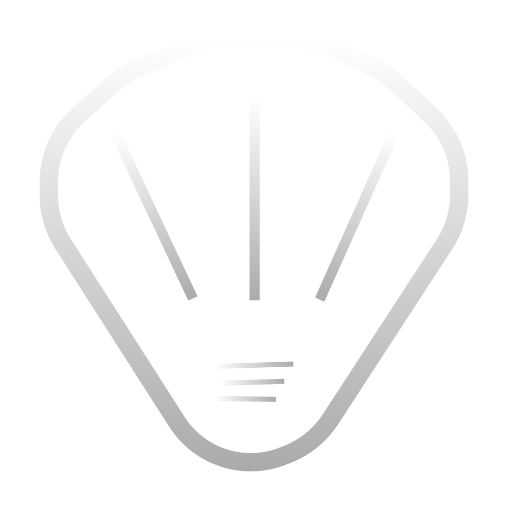

You are a senior web designer and UX engineer working on the WitShells Studio website.
The approved design reference is `remixed-d0c1db75.html` — study it before writing any code.
This document is the canonical brief. Follow it exactly.

---

DESIGN REFERENCE
================

File: `remixed-d0c1db75.html` (in this workspace)
This file represents the visual direction the client has approved. Study its structure, CSS
patterns, font choices, and component layouts before touching any code.

Key approved elements to carry forward:
- Syne 800 for all headings
- DM Mono for body/monospace text
- Instrument Serif italic for decorative heading accents (.it / .accent)
- #080808 body background, #4ade80 green accent
- Grid-line hero background (CSS background-image double gradient, masked)
- Green marquee tech strip between hero and services
- Numbered service cards (01/05 format) with top-border sweep hover
- 2-col project grid with a `featured` card spanning both columns
- Industries section with large low-opacity numbers + left-border hover
- Client reviews section with actual verified Fiverr reviewer names
- Custom cursor: dot (12px) + lagging ring (36px) via requestAnimationFrame
- Scroll indicator: animated vertical line with "Scroll" label, bottom-right
- Section labels: small green ALL-CAPS text with 24px leading horizontal line
- IntersectionObserver reveal with `.reveal` + `.visible` classes
- Stagger delays: `.reveal-delay-1` through `.reveal-delay-4` (0.1s–0.4s steps)

---

COMPANY INFORMATION (Use only this — do not invent)
====================================================

Company name: WITSHELLS STUDIO (SMC-PRIVATE) LIMITED
Legal registration: Companies Act 2017, SECP Pakistan
Location: Sindh, Pakistan
Business email: witshells@gmail.com   ← the ONLY email to use anywhere on the site
Website: witshells.com
Google Analytics: G-6W63VJ0EKB
AdSense: ca-pub-5505051331408030

Founders:
- Syed Suleman Shah — Co-Founder & CTO. 7+ years Unity, VR/AR, multiplayer systems,
  backend APIs. Built military tactical systems (Phoenix Technologies), K-12 VR
  (Kuwait University), child safety tools. Creator of WitClientApi and Thread Manager
  open-source Unity packages. Currently contracted at Phoenix Technologies.
- Naima Ghulam Muhammad — Co-Founder & Company Director. Full-Stack Architect.
  MERN Stack, React/Next.js, product strategy. Currently at Mingo.com. Leads client
  relations, business development, and government procurement for WitShells.

Active clients:
- Phoenix Technologies — real-time military tactical simulation system (enterprise NDA)
- NexSkill — Unity education and game development instruction
- Mixeal — VR educational experiences and metaverse football game (2024–2025)

Logo file: images/witshells.png  ← always use this PNG, never an inline SVG

---

SITE ARCHITECTURE
=================

Three pages. No others.

  index.html     — single scrollable company page (all sections below)
  products.html  — coming soon page with email signup
  portfolio.html — full filterable project grid

Internal links: #hero #about #services #industries #clients #work #contact
External page links: portfolio.html, products.html, privacy-policy.html, terms-of-service.html

---

COLOR & TYPOGRAPHY SYSTEM
==========================

Fonts (load from Google Fonts):
  Syne: 400 600 700 800
  DM Mono: 300 400 500
  Instrument Serif: italic

CSS variables:
  --green: #4ade80
  --green-dim: #22c55e
  --green-glow: rgba(74,222,128,0.15)
  --green-glow-strong: rgba(74,222,128,0.3)
  --bg: #080808
  --bg-2: #0f0f0f
  --bg-3: #141414
  --bg-card: #111111
  --border: rgba(74,222,128,0.12)
  --border-bright: rgba(74,222,128,0.35)
  --text: #f0f0f0
  --text-dim: #888
  --text-muted: #555
  --white: #ffffff

Body font: 'DM Mono', monospace
Heading font: 'Syne', sans-serif (800 weight)
Italic accent: 'Instrument Serif', serif (use class `.it` or `.accent` on spans)

---

NAVIGATION
==========

Fixed top bar. Blur backdrop. Green bottom border.
Logo:  + Syne text "Wit[green]Shells[/green] Studio"
Links: Services · Work · Industries · Team · Reviews
CTA button: "Start a Project" → #contact  (NOT mailto, NOT Calendly)
Mobile: hamburger collapses nav links. Nav toggle button, aria-expanded attribute.

---

HERO SECTION (#hero)
====================

Background: CSS grid lines (double linear-gradient, 60px spacing, green 4% opacity,
  masked with radial-gradient ellipse so lines fade to edges)
Background glow: large radial ellipse, centred top-50% left-50%, 800×400px
Hero tag: small pill "WitShells Studio · Est. Pakistan · Serving Globally"
  with blinking green dot before text
Headline (Syne 800, clamp 3.5→8rem): "Simulate. / Adapt. / Advance."
  "Adapt." uses Instrument Serif italic in green
Sub: "We build immersive simulations, training systems, and interactive experiences
  that close the gap between knowledge and real-world readiness. Defence. EdTech. Games."
Actions: "See Our Work" → #work (btn-primary) + "Start a project →" → #contact (btn-ghost)
Stats bar (border-top, 4-col flex):
  50+ Projects Delivered · 7+ Years Experience · SECP Registered Company · Active Contracts
  (Do NOT use Fiverr/Upwork ratings as primary stats)
Scroll indicator: bottom-right, animated vertical line + "Scroll" vertical text

---

MARQUEE STRIP
=============

Full-width green (#4ade80) background bar immediately after hero.
White/dark text, infinite scroll left animation (duplicate content for seamless loop).
Content: Unity3D ✦ VR / AR Training ✦ Military Simulations ✦ EdTech K-12 ✦
  Multiplayer Games ✦ Child Safety Tech ✦ ASP.NET Core ✦ WebGL Delivery

---

SERVICES SECTION (#services)  bg: --bg-2
=========================================

Header: 2-col grid (title left, description paragraph right)
Section label: "What We Build"
Title: "Serious tech for [italic]serious[/italic] purposes."

5 service cards in a 3-col grid (gap: 1px, bg: --border creates separator lines):
  01 / 05 — Defence & Professional Training Simulations
    Unity3D · Kinect · Real-time Sync · Tablet Deploy
  02 / 05 — EdTech & Awareness Simulations
    VR/XR · Oculus Quest · WebGL · K-12
  03 / 05 — Multiplayer Games & Developer Tools
    Netcode · Mirror · Photon · Open Source
  04 / 05 — AI Integration & Intelligent Systems
    LLM · MCP · AI NPCs · Smart Feedback
  05 / 05 — Backend & Full-Stack Systems
    ASP.NET · AWS · Docker · React

Each card: number top-left (text-muted) · emoji icon · service name (Syne 700) · desc ·
  tags row. On hover: top 2px green bar sweeps left→right via transform: scaleX.

---

WORK SECTION (#work)  bg: --bg
===============================

Header: 2-col flex (title left, "See all 50+ projects →" ghost link right)
Section label: "Selected Work"
Title: "Real projects. [italic]Real outcomes.[/italic]"

Project grid (2-col, gap 1.5rem):

  Featured card (grid-column: span 2, 2-col internal grid):
    Left: category / name (2.2rem) / desc / meta (client + link)
    Right: project-visual placeholder div
    Project: Military Tactical Simulation System
    Category: Defence · Real-Time Simulation
    Client: Phoenix Technologies · Gujranwala Cantt
    Note: NDA — Enterprise Contract

  WheelToWin — Car Racing Game
    Category: Multiplayer · Game
    Desc: Real-time multiplayer racing with custom backend, leaderboards, matchmaking.

  RescuedVR — Child Safety Simulation
    Category: Child Safety · Awareness
    Desc: Children safely experience grooming/trafficking manipulation through social
    media — building protective awareness before real exposure.

  Egypt VR — Ancient History
    Category: EdTech · History VR
    Client: Kuwait University

  Marduga
    Category: Multiplayer · Game Jam
    Desc: 1v1 car combat on hexagonal arena. Live on Wavedash.
    Link: https://wavedash.com/games/marduga

  WitCoin Platform
    Category: Platform · Own Product
    Desc: Sponsor-funded competitive gaming. Players mine WitCoin, stake in skill
    matches. Prize pools paid directly to winners. Live on Android.
    Link: https://witcoin.witshells.com/

Cards: on hover, border brightens + translateY(-4px) + radial green glow via ::after.

---

INDUSTRIES SECTION (#industries)  bg: --bg
==========================================

Section label: "Verticals"
Title: "Where we [italic]operate.[/italic]"

6-item grid (3-col, gap: 1px, bg: --border):
  01 — Defence & Security
  02 — EdTech & K-12
  03 — Child Safety & Social Impact
  04 — Gaming & Entertainment
  05 — Corporate Training
  06 — Web & Enterprise Software

Each item: large low-opacity number (rgba(74,222,128,0.12), 3rem, Syne 800) · name · desc
On hover: background lightens + left border becomes solid green + number opacity increases.

---

TEAM SECTION (#team)  bg: --bg-2
==================================

Section label: "The Studio"
Title: "Two builders. [italic]One vision.[/italic]"

2-col card grid. Each card:
  Avatar: use  with the real profile photo (images/suleman.png / images/naima-profile.png)
    styled as 72×72px with green border-bright
  Name (Syne 700 1.3rem)
  Role (green, ALL CAPS, letter-spacing)
  Bio paragraph
  Skills tags row

  Syed Suleman Shah — Co-Founder · CTO · Unity & VR Engineer
    [Bio from remixed file — accurate, detailed, professional]
    Skills: Unity3D · VR/XR · Netcode · ASP.NET Core · Java Spring · AWS · AI/LLM

  Naima Ghulam Muhammad — Co-Founder · CEO · Full-Stack Architect
    [Bio from remixed file — accurate, professional]
    Skills: React/Next.js · Frontend Architecture · MERN Stack · Product Strategy · Client Management

IMPORTANT: Do not mention personal relationship between founders.
Do not use "nominee" language. Keep strictly professional.

---

REVIEWS SECTION (#reviews)  bg: --bg-2
========================================

Section label: "Client Feedback"
Title: "What clients [italic]say.[/italic]"

3-col grid of review cards. Use the three REAL verified Fiverr reviews:

  Card 1 — adnan1160 · Fiverr ★★★★★
    "Amazing seller. If you need help I promise you this is the man to ask — accommodated
    a shifting timeline and delivered with a level of professionalism that is rarely found
    on Fiverr. Would repeat without hesitation."

  Card 2 — khalid · Fiverr ★★★★★
    "Exceptional work! Delivered ahead of schedule with outstanding quality. Communication
    was clear and professional throughout. Highly recommend for anyone seeking top-notch
    results. Will definitely hire again!"

  Card 3 — asad orabic · Fiverr ★★★★★
    "I want to personally thank Mr. Syed for his exceptional expertise in REST APIs.
    Having had the pleasure of working with him on two projects — I can attest to his
    remarkable dedication and hard work. Highly recommended."

Below grid: ghost link "50 reviews on Fiverr →" + "5★ on Upwork →" (secondary, no prominence)

---

CONTACT SECTION (#contact)  bg: --bg
======================================

Large centred headline: "Let's make something [italic]real.[/italic]"
Sub: "Whether it's a defence simulation, an educational VR experience, a multiplayer game,
  or a full-stack platform — we are open."

FORM (required — no Calendly, no mailto CTA as primary action):
  Fields: Name · Email · Service (dropdown) · Project Brief (textarea)
  Service options: Game Development / Enterprise Software / VR-AR Simulation /
    Web3 Blockchain / General Inquiry
  Submit button: "Send Message"
  On submit: send to https://witcoin.witshells.com/api/PublicStatus/send-email
    Method: POST, Content-Type: application/json
    Header: X-Import-Password: NaiLaMan12ta4$
    Body: { to: "witshells@gmail.com", subject: "...", body: "..." }
  On success: show success message, fire achievement burst animation (see GAMIFICATION)
  Email fallback line below form: "Or email us: witshells@gmail.com"

Do NOT add: Calendly link, WhatsApp number, personal phone number.

---

FOOTER
======

3-col flex row (logo | links | legal):
  Logo: Wit[green]Shells[/green] Studio text
  Links: Services · Work · Team · LinkedIn (witshells company) · Instagram (witshells)
  Legal: © 2026 WITSHELLS STUDIO (SMC-PRIVATE) LIMITED · Registered under Companies
    Act 2017, SECP Pakistan

Privacy Policy and Terms of Service links must be present.

---

GAMIFICATION SYSTEM
====================

Shared file: gamification.js — unchanged. Include on all pages.

Points:
  visit index.html: +10 · scroll bottom: +5 · click services: +10 · click about: +10
  hover team 3s: +5 · click contact: +15 · submit form: +50 · visit products: +20
  sign up notify: +100 · visit portfolio: +15 · share: +30

Levels:
  1 Explorer    0–30 pts   standard content
  2 Curious     31–70 pts  unlock: founder note in team section
  3 Insider     71–130 pts unlock: product preview + vision quote, badge "WitShells Insider"
  4 Early Believer 131+ pts unlock: early-access form, badge, confetti

Widget: fixed bottom-right, collapsible ⚡ button, panel shows pts/level/progress bar/badges.
Locked content: shows as shimmer teaser card ("🔒 Earn XP to unlock") not hidden.

ACHIEVEMENT BURST on contact form submit:
  - 38 particles explode from submit button (multi-colour: green, cyan, white, yellow, purple)
  - Achievement banner slides in from right: "🏆 Achievement Unlocked · Project Inquiry Sent · +50 XP"
  - Viewport edge flash (green border glow on body, 0.9s fade)
  These are in: style.css (.ws-submit-particle, .ws-achieve-banner, .ws-vp-flash)
  and index.html inline script (fireSubmitAchievement function).

---

CUSTOM CURSOR
=============

Two elements: .cursor (12px dot, green, mix-blend-mode: screen) +
.cursor-ring (36px ring, border 1px rgba(74,222,128,0.5)).
Cursor follows mouse immediately. Ring lags behind via requestAnimationFrame lerp (factor 0.12).
On hover over interactive elements: cursor grows to 20px, ring to 52px.
Mobile: hide both cursor elements entirely.

---

ANIMATIONS & MOTION
====================

Hero elements: fadeUp 0.8s stagger (0.2s, 0.4s, 0.6s, 0.8s, 1.0s, 1.5s for scroll)
Scroll reveals: IntersectionObserver, .reveal class, opacity 0→1 + translateY(40→0),
  threshold 0.1. Stagger via .reveal-delay-1 through .reveal-delay-4.
Marquee: translateX 0 → -50% loop, 20s linear infinite.
Service card top border: transform scaleX(0→1) on hover, transform-origin left.
Hero logo: floating animation translateY 0→-11px→0, 4.5s, concentric spinning rings.

---

SEO
===

Title: "WitShells Studio — Simulate. Adapt. Advance. | Pakistan Tech Company"
Description: "WITSHELLS STUDIO (SMC-PRIVATE) LIMITED — Registered Pakistani technology
  company building military simulations, VR educational experiences, multiplayer games,
  and enterprise software. Based in Sindh, Pakistan."
Canonical: https://witshells.com/
OG: title · description · type: website · url: witshells.com
Schema.org Organization: name, url, email (witshells@gmail.com), address (Sindh, PK)
robots: index, follow
Analytics: G-6W63VJ0EKB on all pages
AdSense: ca-pub-5505051331408030 on index.html

---

HARD RULES
==========

- Email: witshells@gmail.com ONLY — nowhere else
- Voice: "We" throughout. Never "I"
- No Calendly. No personal WhatsApp. No personal social links
- No pricing. No product names/screenshots
- Logo: always images/witshells.png — never an inline SVG
- Pages: only index.html, products.html, portfolio.html, privacy-policy.html, terms-of-service.html
- Do not invent company information. Use only what is listed in COMPANY INFORMATION above
- Stats in hero must be company stats (projects, years, contracts) — not Fiverr/Upwork ratings
